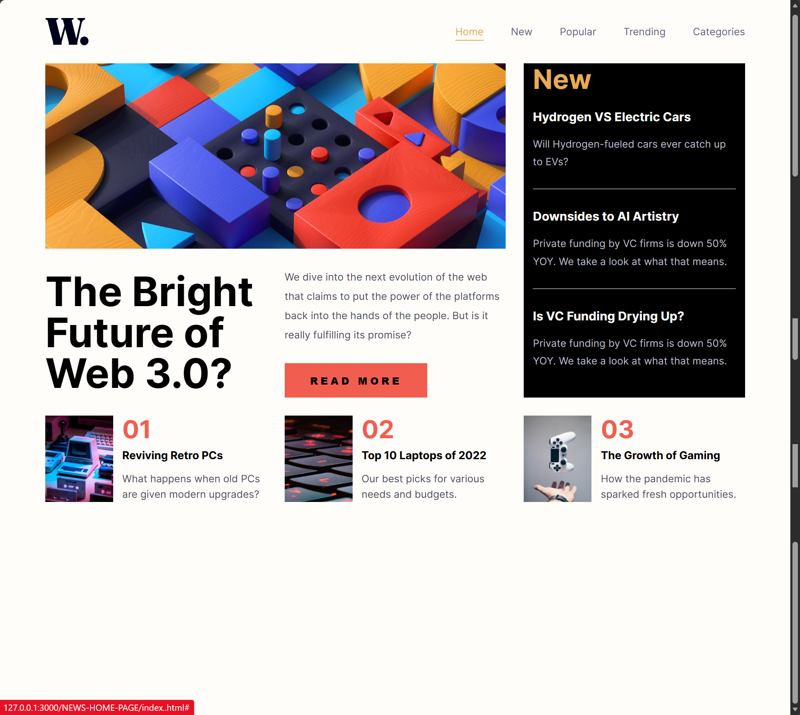
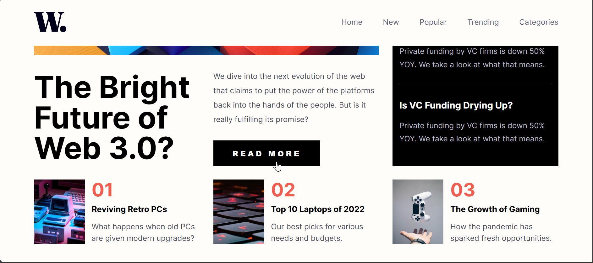
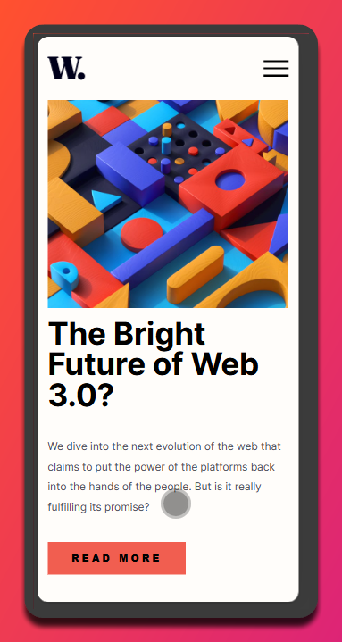
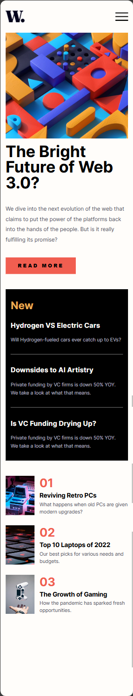
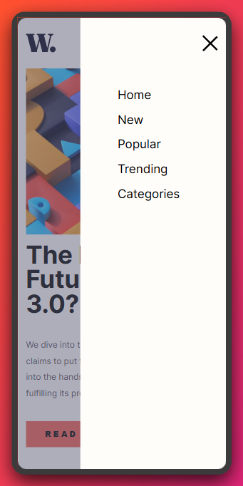

# Frontend Mentor - News homepage solution

This is a solution to the [News homepage challenge on Frontend Mentor](https://www.frontendmentor.io/challenges/news-homepage-H6SWTa1MFl). Frontend Mentor challenges help you improve your coding skills by building realistic projects.

## Table of contents

- [Frontend Mentor - News homepage solution](#frontend-mentor---news-homepage-solution)
	- [Table of contents](#table-of-contents)
	- [Overview](#overview)
		- [The challenge](#the-challenge)
		- [Screenshot](#screenshot)
		- [Links](#links)
	- [My process](#my-process)
		- [Built with](#built-with)
		- [What I learned](#what-i-learned)
	- [Author](#author)

## Overview

### The challenge

Users should be able to:

- View the optimal layout for the interface depending on their device's screen size
- See hover and focus states for all interactive elements on the page

### Screenshot







### Links

- Solution URL: [Checkout the source code👩🏿‍🍳](https://github.com/jidoG8/NEWS-HOME-PAGE.git)
- Live Site URL: [Checkout the live preview here👀](https://jidog8.github.io/NEWS-HOME-PAGE/#)

## My process

### Built with

- Semantic HTML5 markup
- CSS custom properties
- Flexbox
- CSS Grid
- Mobile-first workflow
- JavaScript

### What I learned

- I learn to how to design a hamburger menu using CSS and JavaScript
- I also learned how to align items in rows and columns in a single container using CSS grid

```html
<header class="header">
	<section class="header__logo-container">
		
	</section>
	<nav id="nav__desktop" class="nav">
		<section class="nav__dropdown">
			<ul class="nav__menu">
				<li class="nav__menu-item">
					<a href="#" class="nav__menu-link">Home</a>
				</li>
				<li class="nav__menu-item">
					<a href="#" class="nav__menu-link">New</a>
				</li>
				<li class="nav__menu-item">
					<a href="#" class="nav__menu-link">Popular</a>
				</li>
				<li class="nav__menu-item">
					<a href="#" class="nav__menu-link">Trending</a>
				</li>
				<li class="nav__menu-item">
					<a href="#" class="nav__menu-link">Categories</a>
				</li>
			</ul>
		</section>
	</nav>
	<nav id="nav__hamburger" class="nav">
		<section class="hamburger__menu">
			<section class="hamburger__icon" onclick="toggleMenu()">
				<span></span>
				<span></span>
				<span></span>
			</section>
			<section class="hamburger__links">
				<li class="hamburger__item">
					<a href="#" class="hamburger__link">Home</a>
				</li>
				<li class="hamburger__item">
					<a href="#" class="hamburger__link">New</a>
				</li>
				<li class="hamburger__item">
					<a href="#" class="hamburger__link">Popular</a>
				</li>
				<li class="hamburger__item">
					<a href="#" class="hamburger__link">Trending</a>
				</li>
				<li class="hamburger__item">
					<a href="#" class="hamburger__link">Categories</a>
				</li>
			</section>
		</section>
	</nav>
	<section class="hamburger__backdrop" onclick="toggleMenu()"></section>
</header>
```

```css
.proud-of-this-css {
	/* HAMBURGER MENU FADE FILTER */
	.hamburger__backdrop {
		position: fixed;
		top: 0;
		left: 0;
		width: 100vw;
		height: 100vh;
		background-color: var(--dark-grayish-blue);
		z-index: 999;
		opacity: 0;
		visibility: hidden;
		transition: opacity 0.3s ease-in-out, visibility 0.3s ease-in-out;
	}

	.hamburger__backdrop.open {
		opacity: 0.5;
		visibility: visible;
	}
}
```

```js
function toggleMenu() {
	const menu = document.querySelector(".hamburger__links");b
	const icon = document.querySelector(".hamburger__icon");
	const backdrop = document.querySelector(".hamburger__backdrop");

	menu.classList.toggle("open");
	icon.classList.toggle("open
	backdrop.classList.toggle("open");
}
```

## Author

- Frontend Mentor - [@jidoG8](https://www.frontendmentor.io/profile/jidoG8)
- Twitter - [@OjjaC1253](https://x.com/OjjaC1253)
- LinkedIn - [@ojja-caesar](https://www.linkedin.com/in/ojja-caesar-134980345/)
